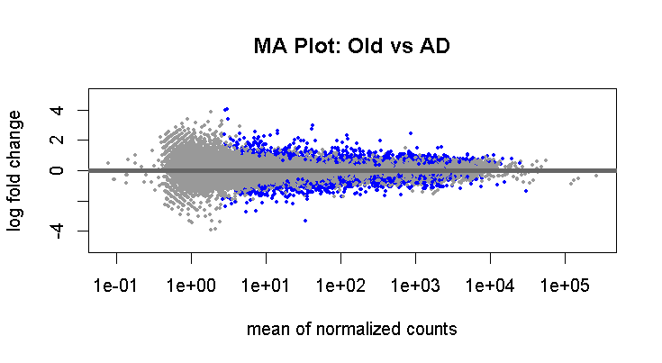

# 🧠 RNA-seq Differential Expression Analysis of Alzheimer’s Disease Cortex Tissue

This project analyzes RNA-seq data from the prefrontal cortex of Alzheimer’s patients and age-matched controls using DESeq2. Contrary to expected neuroinflammatory signatures, the results highlight dysregulation in DNA repair, cell cycle control, and metabolic stress.

---

## 📁 Dataset

- **GEO Accession**: [GSE153873](https://www.ncbi.nlm.nih.gov/geo/query/acc.cgi?acc=GSE153873)
- Tissue: Prefrontal cortex
- Groups: Alzheimer's disease (AD) vs. cognitively healthy Old controls

---

## 🎯 Objective

To test whether **neuroinflammation-related genes** are upregulated in Alzheimer's disease compared to healthy controls using differential expression analysis.

---

## 🔧 Workflow

1. **Data Wrangling**
   - Processed STAR-aligned count matrix (`GSE153873_summary_count.star.txt.gz`)
   - Metadata parsed from SOFT-formatted file
2. **DE Analysis**
   - Performed using `DESeq2` in R
   - Filtering: padj < 0.05, |log2FC| > 1
3. **Functional Enrichment**
   - Conducted with `enrichR` on DEGs upregulated in AD

---

## 📊 Key Results

- Classical neuroinflammatory genes (*TNF*, *IL1B*, *C3*, etc.) were **not significantly upregulated** in AD.
- Enrichment analysis highlighted:
  - ✅ DNA damage response (e.g., homologous recombination)
  - ✅ Cell cycle checkpoint regulation
  - ✅ Metabolic stress pathways
- Suggests a **non-inflammatory** transcriptional shift in AD prefrontal cortex.

---

## 📈 Visualizations

| Volcano Plot | GO Term Enrichment |
|--------------|--------------------|
|  |  |  

---

## 🧪 Tools & Packages

- `DESeq2` for differential expression
- `enrichR` for pathway analysis
- `EnhancedVolcano`, `ggplot2` for plotting
- `GEOquery` for metadata handling

---

## 💬 Interpretation

> *While canonical neuroinflammatory genes were not strongly differentially expressed in AD samples, enriched biological processes suggest dysregulation in DNA repair, cell cycle progression, and metabolic stress — all consistent with neurodegenerative mechanisms.*

---

## 🔗 Links

- 📂 **GEO Dataset**: [GSE153873](https://www.ncbi.nlm.nih.gov/geo/query/acc.cgi?acc=GSE153873)
- 📘 **LinkedIn Post**: [Link to your post] (add later)
- 🧬 **My Bioinformatics Portfolio**: [Optional link]

---

## 🧑‍🔬 Author

**Anurag Sharma**  
Bioinformatics Enthusiast | R & Python | Genomics  
[LinkedIn](https://www.linkedin.com/in/anurag-shr) • [GitHub](https://github.com/anurag-shr)

---

## 📜 License

This project is open-source under the MIT License.
